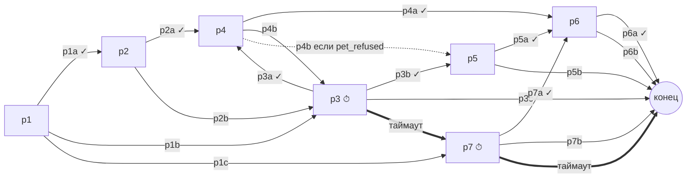
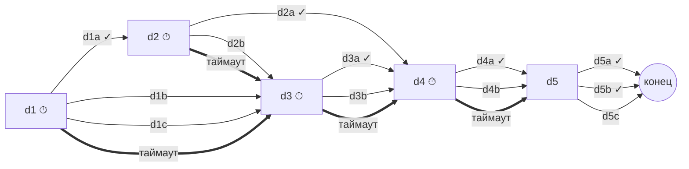
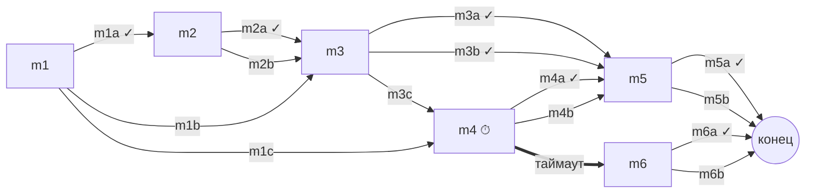
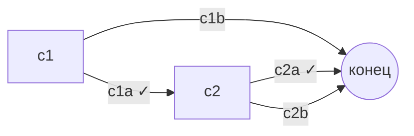
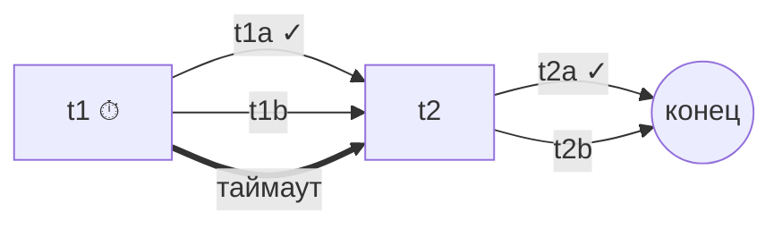

# VSM-Train: практический режим «Смена» — UX-концепция, сценарий №4/№6/№28 и план интеграции

Основа документа — ветка `main` репозитория [PolzovatelYouTube/VSM-Train](https://github.com/PolzovatelYouTube/VSM-Train) (коммит `2758698`), методичка «Ситуации на борту» и фото из `Датасет/`. Код репозитория не менялся. Сценарий смены проверен на настоящих `shared/engine.ts` и `scenarioDataSchema`: схема валидна, пути прогонялись через `createSim/tick/chooseOption/timeoutDialogue/computeResult` (подробности в разделе B.4).

Сопутствующие файлы (в `docs/scenarios/`):

- `shift-4-6-28.scenario.json` — готовый к импорту `ScenarioData` (version 1). Вагоны построены через `buildCar`.
- `shift-4-6-28.cinematics.json` — манифест кинематографических реакций. Для каждого варианта и каждого `onTimeout` в нём задано, что меняется в кадре и на карте.

## 0. Как учтены ваши замечания

| Замечание | Решение в концепции |
|---|---|
| Таймер нужен только на практике | Режим `training`: никаких таймеров, пауза симуляции на диалоге, подсказки. Режим `check` («практика»): `TimerRing`, `onTimeout`, без подсказок. Ветки `onTimeout` проходятся только в практике — это учтено в проверке достижимости. |
| Любой выбор должен на что-то влиять | Каждый вариант даёт три видимых последствия: (1) реакцию в кадре — поза и эмоция персонажа, реквизит, план камеры, подпись; (2) реакцию на CarMap — актор идёт, пересаживается, меняется его настроение, появляется предмет; (3) изменение шкал. Пустых вариантов нет: у всех 58 исходов (варианты и таймауты) есть запись в манифесте, и это проверяет линтер. |
| Карта: нужны столики | `buildCar` получает вариант компоновки `tables: true` (бизнес и комфорт): отсеки из пары рядов лицом друг к другу со столом между ними, плюс маркер направления кресла. CarMap не переписывается, в `CellView` добавляется отрисовка спинки. Подробно — в C.3. |
| Нужна визуальная подача «как в Dispatch» | Сцена события строится как «серия»: общий план, наезд на персонажа, реплика, выбор под таймером, монтажная склейка с реакцией, плашка «Орлова это запомнит». Это приёмы Dispatch и Telltale — таймерные выборы внутри анимированных диалогов ([Rolling Stone India](https://rollingstoneindia.com/indie-game-dispatch-mixes-the-office-with-superheroes-in-a-playable-tv-show/)) и всплывающие «X will remember that» ([Eneba](https://www.eneba.com/hub/games/dispatch-review/)) — но на 2D-средствах: фото, PNG-вырезки, CSS transform. Без 3D. |

Честно о пределе: у Dispatch полноценная анимация персонажей, и мы её не повторим. Ощущение «фильма» дают монтаж (смена планов), параллакс слоёв, смена поз-спрайтов и синхронная реакция карты. По соотношению затрат и эффекта это лучший вариант до дедлайна 27.09, 23:59.

---

# Часть A. UX/UI-концепция практического режима

## A.1 Двухслойная визуальная система

| Слой | Назначение | Источник правды | Точность |
|---|---|---|---|
| Слой 1 — CarMap (SVG) | Где что происходит: места, проход, тамбуры, столики, маршруты актёров, НП и ПТБ | `ScenarioData.train.cars` + `SimState.actors` | Точная: 2+1, 2+2, 3+2, бистро, номера мест. |
| Слой 2 — EventStage (сцена) | Что чувствует пассажир и что изменил ваш выбор | Фото-фон, PNG персонажа, манифест реакций, `SimState.log`/`flags` | Атмосферная: фото 2+2 со столом — только фон. Для 2+1 и 3+2 фон размыт и затемнён, ряд кресел в кадре не читается. |

Оба интерьерных фото (`Датасет/photo_2026-09-20_15-10-04.jpg` и `…15-10-05.jpg`) портретные, 714×1280. На мобильном они встают почти без обрезки, на десктопе в сцене 16:9 используется `object-fit: cover` с точкой фокуса на столе, а края добираются размытой копией того же кадра.

Правило согласования: сцена никогда не показывает номер места или компоновку — это делает только карта. Сцена показывает лица, реквизит и эмоции. Поэтому фото 2+2 не противоречит вагону 3+2. На сцене всегда есть мини-бейдж «Вагон 4 · Стандарт · 6B», и он указывает на подсвеченную клетку на карте.

## A.2 Раскладка экрана

Десктоп (≥1024 px):

```
┌──────────────────────────── TopBar: Clock · Meter L · Meter S · TrainStrip ─────────────────────┐
│ ┌──────────── EventStage 16:9 (≈62% ширины) ─────────────┐ ┌── Aside (≈38%) ──────────────────┐ │
│ │ фон-фото + персонаж + реквизит + подпись               │ │ CarOverview: CarMap текущего     │ │
│ │ бейдж «Вагон 4 · 6B»                        TimerRing  │ │ вагона (масштаб по ширине)       │ │
│ │ ── DialogueOverlay (нижняя треть сцены) ──             │ │ лента событий (feed)             │ │
│ │ реплика; варианты 1–4 (клавиши 1–4)                    │ │ MeterFeedback: +5 / −15 дельты   │ │
│ └────────────────────────────────────────────────────────┘ └──────────────────────────────────┘ │
└──────────────────────────────────────────────────────────────────────────────────────────────────┘
```

Мобильный (<768 px, портрет): сверху компактная строка шкал, под ней сцена 4:3 (высота около 42vh), под сценой CarMap в полосе высотой 120 px с горизонтальной прокруткой к актору. Варианты — снизу, bottom sheet во всю ширину, кнопки не ниже 48 px. Таймер — полоса по верхнему краю sheet, а не кольцо.

## A.3 Одиннадцать состояний экрана

Для каждого состояния: что видно на экране; положение CarMap; фото-сцена; реплики и варианты; анимации; ассеты; отличия на мобильном.

### 1. Вступление в рейс (`intro`, t = 0, до старта rAF)

- Экран: полноэкранный рендер поезда (`exterior`), титр «ВСМ №705 · Смена 1 · 4 вагона», карточка роли «Вы — проводник вагонов 1–4», кнопка «Начать смену». В практике — плашка «Таймеры включены, подсказок нет».
- CarMap: пока скрыт. Внизу `TrainStrip` собирается из вагонов слева направо.
- Сцена: во весь экран, фото снаружи, медленный наезд (Ken Burns).
- Реплики и варианты: нет, только CTA.
- Анимации: `transform: scale(1.0→1.06)` за 6 с; вагоны `TrainStrip` появляются с задержкой 80 мс каждый; с `prefers-reduced-motion` — статичный кадр.
- Ассеты: `photo_exterior.jpg`, логотип.
- Мобильный: текст поверх фото с градиентом снизу, кнопка во всю ширину.

### 2. Обычное наблюдение за вагоном (`observe`)

- Экран: главная — карта. Сцена показывает «спокойный фон» текущего вагона (фото, лёгкое размытие), поверх — мини-подписи из `feed`.
- CarMap: слева крупно (на десктопе меняется местами со сценой: карта 62%, сцена 38%). Работают `ActorView` и `Bubble`, follow-камера на вагон, где идёт действие.
- Сцена: справа, 16:9, фон вагона.
- Реплики: пузыри `Bubble` на карте, вариантов нет.
- Анимации: ходьба актёров (`moveAlongPath`, уже есть), дыхание фона `scale 1↔1.02` за 8 с.
- Ассеты: фоновое фото класса.
- Мобильный: карта во весь экран, сцена свёрнута в плашку 64 px («Всё спокойно · Вагон 2»).

### 3. Появление события (`event_alert`, `triggerEvent` поставил `active`)

- Экран: на 600 мс плашка категории цвета `CATEGORY_COLOR` («Просьба · Вагон 2»), звук-сигнал (выключаемый).
- CarMap: пульсирующее кольцо `pulse-ring` на акторе (уже есть в `ActorView`), остальные акторы приглушены (opacity 0.4).
- Сцена: панели меняются местами (FLIP-анимация 400 мс): сцена становится главной.
- Реплики: нет.
- Анимации: swap через `transform`; плашка — slide-down.
- Ассеты: иконки категорий (есть в `CATEGORY_COLOR`, нужны только SVG-иконки).
- Мобильный: плашка сверху (toast), сцена разворачивается из 64 px до 42vh.

### 4. Фокус камеры на пассажире (`focus`, 800–1200 мс)

- Экран: «кадр-наезд» с общего плана сцены на средний план персонажа; бейдж «Вагон 2 · Бизнес · 4C».
- CarMap: зум SVG `viewBox` на клетку актора (±3 клетки) с плавной интерполяцией; от бейджа к клетке тянется тонкая связующая линия.
- Сцена: фон `translate/scale` к зоне кресла; PNG персонажа (поза `neutral` или `pose` из узла) выезжает снизу.
- Реплики: имя говорящего, реплика печатается по буквам (typewriter, 30 символов/с, клик — показать сразу).
- Анимации: `transition: transform 900ms cubic-bezier(.2,.8,.2,1)`; viewBox анимируется через rAF (SVG `viewBox` не анимируется через CSS).
- Ассеты: PNG персонажа (прозрачный фон), 3–4 позы.
- Мобильный: без зума карты, только подсветка клетки; сцена в 4:3.

### 5. Диалог без таймера (training или узел без `timerSec`)

- Экран: сцена + `DialogueOverlay` в нижней трети, 2–4 варианта. В тренировке рядом с вариантами — чипы шага ролевой модели и `hint`.
- CarMap: мини-карта в aside, симуляция на паузе (`pauseWhileDialogue: true`), акторы замерли.
- Сцена: средний план; персонаж «дышит» (idle scale 1↔1.01).
- Реплики и варианты: кнопки с номерами 1–4, фокус с клавиатуры, `aria-live` на реплике.
- Анимации: варианты появляются с задержкой 60 мс каждый после окончания печати реплики.
- Ассеты: нет новых.
- Мобильный: bottom sheet, реплика — в сцене на плашке.

### 6. Диалог с таймером (practice, узел с `timerSec`)

- Экран: то же, плюс `TimerIndicator` (из `TimerRing`) в правом верхнем углу сцены и полоса по краю overlay. В последние 30% времени — виньетка сцены и учащённый пульс кольца.
- CarMap: симуляция идёт, но с x1 и не быстрее (множитель скорости блокируется, пока открыт диалог). Остальные акторы продолжают двигаться — видно, что мир не ждёт.
- Сцена: персонаж в позе узла; при <30% — лёгкий дрейф камеры к лицу (scale +3%).
- Реплики: подсказок нет, шаги ролевой модели скрыты.
- Анимации: `stroke-dashoffset` кольца по `left/limitSec`; виньетка `opacity 0→0.35`.
- Ассеты: нет.
- Мобильный: полоса таймера над вариантами, вибрация `navigator.vibrate(30)` на 30% (если разрешено).

### 7. Истечение времени (`timeoutDialogue`)

- Экран: варианты гаснут и «проваливаются», появляется титр `onTimeout.text` («Пока проводник молчал, Бублик спрыгнул…»).
- CarMap: срабатывает реакция из манифеста (`cues["p3:timeout"]`) — например, иконка собаки появляется в проходе, актор подсвечивается красным.
- Сцена: склейка на общий план (`shot: wide`), поза `angry`/`sick`, краткое затемнение (150 мс).
- Реплики: следующий узел (`onTimeout.next`) открывается через 1,2 с после титра.
- Анимации: `filter: saturate(0.4)` на 600 мс, затем возврат; `MeterFeedback` показывает дельты.
- Ассеты: реквизит (собака в проходе и т. п.).
- Мобильный: титр поверх сцены, sheet скрывается и открывается снова.

### 8. Изменение лояльности и безопасности (после любого выбора)

- Экран: `ConsequenceAnimation` (1,2–1,8 с): склейка на кадр-реакцию с подписью `caption`, затем «летящие» чипы `+5 L`, `−15 S` к шкалам в TopBar. Если вариант задаёт флаг, отмеченный как памятный, появляется плашка «Орлова это запомнит».
- CarMap: одновременно выполняются `map`-шаги реакции — актор идёт (`goto`), садится, меняется `mood` (дуга настроения в `ActorView` уже есть), появляется реквизит.
- Сцена: смена позы-спрайта (`pose`), смена плана (`shot`), реквизит (переноска, стакан, блистер, рация).
- Реплики: реакция персонажа в пузыре на сцене (если в `map` есть шаг `say`).
- Анимации: crossfade поз 200 мс, чипы по `transform` за 700 мс, `Meter` подсвечивает изменившуюся шкалу (красная рамка при падении ниже 40 — уже есть).
- Ассеты: позы, реквизит, короткие звуки (опционально).
- Мобильный: чипы летят к компактной строке шкал.

### 9. Жалоба при loyalty < 30 (`ev_complaint`)

- Экран: отдельная «вставка»: бланк жалобы на сцене, заголовок «Пассажир оставил жалобу». После завершения — штамп «урегулировано» или «эскалация».
- CarMap: в aside карта вагона, откуда пришло недовольство (последний `eventId` с отрицательной L). Актор НП идёт к проводнику.
- Сцена: фон — служебное купе или бистро; крупный план бланка, затем НП.
- Реплики: узлы `c1–c2` без таймера (жалоба — момент рефлексии).
- Анимации: бланк выезжает сверху с поворотом −3°; штамп — `scale 1.4→1` за 180 мс.
- Ассеты: `complaint_form.png`, PNG начальника поезда, штампы.
- Мобильный: бланк во всю ширину сцены.

### 10. Вызов ПТБ при safety < 40 (`ev_ptb`)

- Экран: красная плашка «Угроза безопасности · Вызваны сотрудники ПТБ», по краям экрана — пульсирующая красная рамка.
- CarMap: актор `a_ptb` появляется в бистро (до этого скрыт через `hiddenUntil`) и по реальному `route` идёт в вагон 4; проход подсвечивается зелёным после `t1a`.
- Сцена: общий план вагона, силуэт сотрудника ПТБ в дверях.
- Реплики: `t1` под таймером 15 с в практике, `t2` без таймера.
- Анимации: рамка `box-shadow` пульсирует 1 Гц; с reduced motion — статичная.
- Ассеты: PNG ПТБ (форма без эмблем реальных служб), иконка рации.
- Мобильный: плашка-toast и красная полоса у шкалы безопасности.

### 11. Итоговый разбор смены (`finished`, `DebriefTimeline`)

- Экран: «титры серии». Сверху — `ResultCard` (балл, компетенции). Ниже — горизонтальная лента эпизодов: миниатюра кадра-реакции каждого выбора, цвет по `correct`, отметки таймаутов, пороги 30/40 на мини-графике L/S во времени.
- CarMap: по клику на эпизод — карта в состоянии момента выбора (реплей по `log.t`).
- Сцена: миниатюры из манифеста (кадр `caption`).
- Реплики: для каждого эпизода — «Ваш выбор», «Почему», «Лучше» из `buildDebrief`.
- Анимации: лента выезжает по одному эпизоду за 120 мс.
- Ассеты: нет новых (используются кадры реакций).
- Мобильный: вертикальная лента, график сворачивается.

## A.4 Storyboard смены (12 кадров)

| # | Кадр | Сцена (слой 2) | Карта (слой 1) | Звук и текст |
|---|---|---|---|---|
| 1 | Вступление | Рендер поезда, наезд | `TrainStrip` собирается | «ВСМ №705. Смена началась» |
| 2 | Наблюдение | Размытый салон бизнеса | Орлова идёт с тамбура на 4C, на коленях иконка собаки | Пузырь «Бублик, сиди смирно» |
| 3 | Событие №4 | Swap панелей, плашка «Просьба · Вагон 2» | Кольцо на 4C | Сигнал |
| 4 | Фокус | Средний план: Орлова со шпицем, фон — фото 2+2 со столом | Зум на 4C, бейдж «Вагон 2 · 4C» | Реплика p1, без таймера |
| 5 | Выбор и последствие | p1a: улыбается, гладит собаку, «+5 L». p1c: склейка — собака спрыгивает, «−15 S» | p1c: иконка собаки перемещается в проход | «Орлова это запомнит» |
| 6 | Решение | Переноска на столе, Орлова кивает | Проводник ходит в бистро и обратно; или НП идёт в вагон 2 (p3b) | «Благодарю Вас за понимание» |
| 7 | Событие №6 | Плашка «Конфликт · Вагон 4», общий план, Кузнецов встаёт | Кузнецов выходит в проход 6B → x7, y3 | Громкая реплика d1, таймер 15 с |
| 8 | Нарастание | Под таймером: виньетка, дрейф к лицу. d3a — Смирнов уходит из кадра | Смирнов реально пересаживается на 9D | «Прошу Вас соблюдать спокойствие…» |
| 9 | Рация | Крупный план рации | НП идёт из бистро в вагон 4 (17 клеток) | d4a — нейтральная формулировка; d4b — Кузнецов: «Кто пьяный?!» |
| 10 | Порог (если ошибались) | Красная рамка «Вызваны ПТБ» или бланк жалобы | ПТБ появляется и идёт в вагон 4 | Отдельное событие, один раз |
| 11 | Событие №28 | Белова, первый класс (фон размыт), рука у виска | Кольцо на 3B, вагон 1 | m1 без таймера; при бездействии m4 под таймером 20 с → 12 с |
| 12 | Разбор | Лента эпизодов с кадрами реакций, график L/S с линиями 30 и 40 | Реплей по клику | Балл, XP, ачивки |

## A.5 Ассеты

| Группа | Состав | Источник |
|---|---|---|
| Фоны | 2+2 со столом (2 фото из `Датасет/`), экстерьер (есть); салон 2+1 и 3+2 — либо размытое фото 2+2, либо 2 сгенерированных фона | Есть, плюс генерация |
| Персонажи | Орлова, Кузнецов, Смирнов, Белова, НП, ПТБ, проводник. Позы: neutral / happy / angry / sick. Итого около 16 PNG | Генерация с единым референсом стиля (иллюстрация, не фотореализм — ближе к Dispatch и без проблем с реальными лицами) |
| Реквизит | Шпиц, переноска, стакан воды, блистер, рация, бланк жалобы, штампы | SVG или PNG |
| UI | Иконки категорий, плашка «запомнит», таймер | SVG |

Если ассетов не хватает, сцена деградирует без поломок: вместо PNG показывается силуэт роли из `ROLE_COLOR` с иконкой роли, вместо фона — градиент класса.

---
# Часть B. Учебная смена «№4 → №6 → №28»

## B.1 Состав смены

| Параметр | Значение |
|---|---|
| Поезд | `car1` первый класс 2+1 (6 рядов), `car2` бизнес 2+2 (8), `car3` бистро (6), `car4` стандарт 3+2 (10) |
| Начальные шкалы | `initial: { loyalty: 70, safety: 80 }`, `durationSec: 180` |
| Основные события | `ev_pet` №4 (Орлова, car2 4C, t ≈ 5 с), `ev_drunk` №6 (Кузнецов, car4 6B, t ≈ 31 с), `ev_medicine` №28 (Белова, car1 3B, t ≈ 68 с) — все запускаются через `trigger: actor` и шаг `emit` |
| Последствия | `ev_complaint` — `condition { loyalty: { lt: 30 } }`; `ev_ptb` — `condition { safety: { lt: 40 } }`; `actorId: null` |
| Служебные акторы | `a_conductor`, `a_np` (начальник поезда), `a_ptb` — роль `conductor`, спавн в бистро. Шагов у них нет, двигаются только реакциями из манифеста |

Однократность: `triggerEvent` пишет id в `SimState.fired` и больше его не запускает, так что жалоба и ПТБ срабатывают максимум один раз за рейс, даже если шкала несколько раз опустится ниже порога.

Отличие от существующего `onboard.ts`: там ПТБ — это узел `d_ptb` внутри №6, который достигается через `nextIf`. Здесь ПТБ — отдельное событие, которое может вызвать любая ошибка в любой ситуации. `onboard.ts` не трогаем: на нём держится `tests/onboard.test.ts`.

## B.2 Таймеры

| Узел | По ТЗ | `timerSec` | Эффективно (× `PATIENCE_BY_CLASS.timer`) |
|---|---|---|---|
| `p1`, `p2`, `p4`, `p5`, `p6` | Спокойное обращение №4 | нет | — |
| `p3` | Отказ выполнить требование | 20 | бизнес ×0.75 → 15 с |
| `p7` | Последствие бездействия: собака в проходе | 15 | ≈ 11 с |
| `d1–d4` | №6 под таймером | 15 / 15 / 12 / 15 | стандарт ×1 |
| `d5` | Ожидание НП | нет | — |
| `m1`, `m2`, `m3`, `m5`, `m6` | Просьба о лекарстве | нет | — |
| `m4` | Ухудшение после бездействия | 20 | первый ×0.6 → 12 с |
| `t1` | ПТБ, критическое действие | 15 | 15 с |
| `c1`, `c2`, `t2` | Рефлексия и доклад | нет | — |

В тренировке таймеры не показываются и не срабатывают: `play.tsx` не передаёт limit, `tick` с `pauseWhileDialogue: true` возвращается раньше.

## B.3 Таблица узлов

Столбец L / S — «сырые» `effects`. Движок дополнительно умножает отрицательную L на `loyaltyLoss` класса (бизнес 1.3, первый 1.5). Ролевая модель даёт −10 L за нарушение порядка и +5 L за полную цепочку. Столбец «Кадр» — запись из `shift-4-6-28.cinematics.json`.

### №4 · Питомец без переноски (`ev_pet`)

Категория: `request` · актор: `a_pet_owner` · триггер: шаг актора `emit` · старт: `p1` · класс: бизнес (таймер ×0.75)

| Узел | Говорящий и текст | Таймер | onTimeout | Вариант | L / S | ✓ | Шаг | if | set | next / nextIf | feedback | Кадр (визуальное последствие) |
|---|---|---|---|---|---|---|---|---|---|---|---|---|
| **p1** | Пассажирка Орлова: (у неё на коленях шпиц) Это Бублик, он спокойный. В переноске ему тесно — пусть посидит со мной, хорошо? | нет | — | `p1a` «Я Вас понимаю, Бублик и правда спокойный. Давайте устроим его так, чтобы ему было безопасно в дороге» | +5 / +0 | да | Признать | — | `pet_ack` | `p2` | Начали с признания: пассажирка видит заботу о питомце, а не упрёк. Так методичка советует начинать разговор. | Орлова улыбается и гладит собаку; камера переходит на средний план |
|  |  |  |  | `p1b` «Обращаю Ваше внимание: провоз питомцев — только в переноске» | -5 / +5 | нет | Правило | — | `pet_refused` | `p3` | Правило верное, но названо без признания ситуации: пассажирка слышит упрёк. Ролевая модель добавляет штраф −10 к лояльности. | Орлова прижимает собаку к себе, отворачивается к окну |
|  |  |  |  | `p1c` Разрешить держать собаку на коленях без переноски | +5 / -15 | нет | — | — | `pet_loose` | `p7` | Уступка нравится пассажирке, но нарушает условия провоза: собака без переноски — риск для неё и соседей. | Проводник уходит; через секунду собака спрыгивает в проход |
| **p2** | Пассажирка Орлова: А это обязательно? Переноски у меня с собой нет. | нет | — | `p2a` «Обращаю Ваше внимание, что провоз питомцев осуществляется только в переноске — это необходимо для безопасного нахождения питомцев на борту» | +0 / +5 | да | Правило | — | `rule_explained` | `p4` | Правило объяснено через безопасность самого питомца — без лишней информации, как советует методичка. | Орлова задумчиво кивает |
|  |  |  |  | `p2b` «Правила есть правила. Уберите собаку, или будем решать по-другому» | -10 / +0 | нет | Правило | — | `pet_refused` | `p3` | Правило подано как угроза. Пассажирка отказывается выполнять требование — это ветка с таймером. | Орлова резко отвечает, соседи оборачиваются |
| **p3** | Пассажирка Орлова: Не буду я его запихивать в коробку! Он никому не мешает! | 20 с → 15 с | → `p7`, -5 / -10, set `pet_loose`; «Пока проводник молчал, Бублик спрыгнул и побежал по проходу» | `p3a` «Понимаю, что ситуация неприятная. Давайте найдём удобный для Бублика вариант» | +5 / +0 | да | Признать | — | — | `p4` | Вернулись к признанию ситуации — это снимает напряжение. К признанию можно вернуться в любой момент. | Орлова выдыхает, опускает плечи |
|  |  |  |  | `p3b` «Для решения этого вопроса я приглашу начальника поезда» | +0 / +5 | да | Решение | — | `np_called` | `p5` | При отказе методичка предписывает вызвать начальника поезда. Решение правильное, но разговор с пассажиркой не закрыт. | Проводник говорит в рацию; на CarMap значок НП идёт к вагону 2 |
|  |  |  |  | `p3c` «Тогда на ближайшей станции Вас высадят» | -15 / -5 | нет | — | — | `pet_threat` | `конец` | Угроза — худший исход: конфликт не решён, собака всё ещё без переноски, пассажирка готовит жалобу. | Орлова достаёт телефон и начинает писать жалобу |
| **p4** | Пассажирка Орлова: И где я её возьму посреди поездки? | нет | — | `p4a` «Вы можете приобрести переноску на борту нашего поезда. Я сейчас принесу её» | +5 / +5 | да | Решение | — | `carrier_offered` | `p6` | Конкретное решение из методички: переноска продаётся на борту. | Проводник уходит в бистро и возвращается с переноской |
|  |  |  |  | `p4b` «Это Ваши проблемы — надо было думать при покупке билета» | -15 / +0 | нет | — | — | `pet_refused` | `p3`; nextIf: `pet_refused` → `p5` | Решение переложено на пассажирку. Если она уже отказывалась, конфликт сразу уходит к начальнику поезда. | Орлова повышает голос: «Позовите начальника!» |
| **p5** | Начальник поезда: Подошёл. Что у вас происходит? | нет | — | `p5a` Коротко доложить: пассажирка с питомцем без переноски, предлагаем приобрести переноску на борту | +5 / +5 | да | Решение | — | `carrier_offered`, `np_called` | `p6` | Спокойный доклад по фактам при пассажирке, и сразу предложено решение. | НП кивает Орловой; проводник приносит переноску |
|  |  |  |  | `p5b` Пожаловаться начальнику поезда на пассажирку при ней | -15 / +0 | нет | — | — | `np_called` | `конец` | Обвинение при пассажирке ухудшает конфликт, а вопрос с переноской так и не решён. | Орлова демонстративно отворачивается; НП хмурится |
| **p6** | Пассажирка Орлова: Ладно, несите вашу переноску. | нет | — | `p6a` «Благодарю Вас за понимание! Бублику так будет спокойнее, а я загляну к вам позже» | +10 / +5 | да | Заверить | — | `pet_resolved` | `конец` | Разговор закрыт заверением: пассажирка понимает, что о ней заботятся. | Бублик в переноске у ног; Орлова улыбается |
|  |  |  |  | `p6b` Молча отдать переноску и уйти | -5 / +5 | нет | — | — | `pet_resolved` | `конец` | Проблема решена, но пассажирке не сказали ни слова благодарности — лояльность проседает. | Орлова пожимает плечами; собака в переноске |
| **p7** | Пассажир у прохода: Эй! Собака под ногами, я чуть не упал! | 15 с → 11.2 с | → `конец`, -5 / -15, set `injury`; «Пассажир споткнулся о собаку в проходе» | `p7a` Помочь поймать собаку, убедиться, что никто не пострадал, и предложить хозяйке переноску | +0 / +5 | да | Решение | — | `carrier_offered` | `p6` | Сначала безопасность людей в проходе, затем решение — переноска. | Проводник приседает, берёт собаку; проход свободен |
|  |  |  |  | `p7b` Громко сделать замечание хозяйке на весь вагон | -10 / -5 | нет | — | — | — | `конец` | Публичное замечание не убирает собаку из прохода и настраивает вагон против пассажирки. | Весь вагон оборачивается; собака всё ещё в проходе |



### №6 · Пассажир с признаками опьянения (`ev_drunk`)

Категория: `conflict` · актор: `a_drunk` · триггер: шаг актора `emit` · старт: `d1` · класс: стандарт (таймер ×1.0)

| Узел | Говорящий и текст | Таймер | onTimeout | Вариант | L / S | ✓ | Шаг | if | set | next / nextIf | feedback | Кадр (визуальное последствие) |
|---|---|---|---|---|---|---|---|---|---|---|---|---|
| **d1** | Пассажир Кузнецов: (громко, с запахом алкоголя) Командир! Сделай музыку погромче, мы тут отдыхаем! | 15 с → 15 с | → `d3`, -5 / -15, set `drunk_escalated`; «Пассажир начал задевать соседей» | `d1a` Подойти и спокойно оценить обстановку: «Я Вас понимаю, настроение отличное. Давайте я помогу Вам устроиться» | +0 / +5 | да | Признать | — | `drunk_assessed` | `d2` | Сначала оценка безопасности (агрессия, риск для него и соседей), без спора. | Проводник встаёт в проходе рядом; Кузнецов садится |
|  |  |  |  | `d1b` «Вы пьяны! Немедленно успокойтесь, или Вас высадят» | -15 / -15 | нет | — | — | `drunk_provoked` | `d3` | Слово «пьяны» и угроза провоцируют агрессию — методичка прямо предупреждает об этом. | Кузнецов вскакивает, красный ореол опасности |
|  |  |  |  | `d1c` Не обращать внимания и продолжить обход | -10 / -15 | нет | — | — | — | `d3` | Бездействие: нарушитель остаётся без контроля, соседи не защищены. | Проводник уходит; Кузнецов встаёт и идёт к соседям |
| **d2** | Пассажир Кузнецов: А чё такого? Я никому не мешаю! | 15 с → 15 с | → `d3`, +0 / -10, set `drunk_escalated`; «Пассажир встал и пошёл по вагону» | `d2a` «Прошу Вас соблюдать спокойствие и не создавать неудобств другим пассажирам» | +5 / +5 | да | Правило | — | — | `d4` | Фраза из «Сервисного общения» №6: правило без оценки личности пассажира. | Кузнецов бурчит, но остаётся на месте |
|  |  |  |  | `d2b` Вступить в спор: «Мешаете, и ещё как! Вот соседи жалуются» | -10 / -10 | нет | — | — | `drunk_provoked` | `d3` | Спор и ссылка на соседей переводят конфликт на них. | Кузнецов поворачивается к Смирнову |
| **d3** | Пассажир Кузнецов: (встаёт и толкает соседа) Да вы кто такие вообще, чтобы мне указывать?! | 12 с → 12 с | → `d4`, -5 / -20, set `fight`; «Конфликт перешёл в потасовку» | `d3a` Не вступать в спор, встать между пассажирами и пересадить Смирнова на свободное место | +0 / +10 | да | Решение | — | `neighbour_moved` | `d4` | Главное — безопасность других пассажиров: развести людей, не вступая в спор. | Смирнов переходит на 9D (CarMap: реальное перемещение) |
|  |  |  |  | `d3b` Попытаться вывести пассажира из вагона силой | -10 / -20 | нет | — | — | `used_force` | `d4` | Силовое вмешательство — прямой риск травм. Этим занимаются ПТБ и ЛОВД. | Толкотня в проходе, камера трясётся |
| **d4** | Рация: Нужно сообщить начальнику поезда. Пассажир стоит рядом и всё слышит. Что скажете в эфир? | 15 с → 15 с | → `d5`, +0 / -10, set `np_late`; «Начальник поезда узнал о ситуации от других пассажиров» | `d4a` «Начальник поезда, прошу подойти в 4-й вагон: пассажир нарушает порядок, нужна ваша помощь» | +5 / +10 | да | Решение | — | `np_called` | `d5` | В эфире нет слова «пьян» — пассажир не провоцируется, а НП получает точный адрес. | Иконка рации; на CarMap НП идёт в вагон 4 |
|  |  |  |  | `d4b` «В четвёртом пьяный буянит, срочно сюда» | -10 / -15 | нет | — | — | `np_called`, `drunk_provoked` | `d5` | Пассажир слышит, что его называют пьяным, и агрессия растёт. | Кузнецов оборачивается на рацию: «Кто пьяный?!» |
| **d5** | Начальник поезда: Иду. Оставайтесь рядом, следите за соседями и оборудованием. | нет | — | `d5a` Заверить Смирнова: «Благодарю Вас за понимание. Вы в безопасности, я рядом» | +10 / +5 | да | Заверить | `neighbour_moved` | — | `конец` | Соседа уже пересадили — осталось его заверить. | Смирнов кивает с нового места |
|  |  |  |  | `d5b` Заверить соседей: «Всё под контролем, начальник поезда уже идёт. Если хотите, пересажу Вас» | +10 / +5 | да | Заверить | `neighbour_moved` = false | `neighbour_moved` | `конец` | Заверение с предложением пересадки: соседи защищены, конфликт не разрастается. | Смирнов пересаживается на 9D |
|  |  |  |  | `d5c` Уйти в служебное купе — пусть начальник поезда разбирается сам | -10 / -10 | нет | — | — | `left_post` | `конец` | Методичка требует быть внимательным к другим пассажирам и оборудованию до прихода НП. | Проводник уходит; Кузнецов снова встаёт |



### №28 · Просьба дать лекарство (`ev_medicine`)

Категория: `medical` · актор: `a_headache` · триггер: шаг актора `emit` · старт: `m1` · класс: первый класс (таймер ×0.6)

| Узел | Говорящий и текст | Таймер | onTimeout | Вариант | L / S | ✓ | Шаг | if | set | next / nextIf | feedback | Кадр (визуальное последствие) |
|---|---|---|---|---|---|---|---|---|---|---|---|---|
| **m1** | Пассажирка Белова: Простите, у Вас не найдётся таблетки от головы? Раскалывается. | нет | — | `m1a` «Сожалею, что Вам нехорошо. Подскажите, что беспокоит? Бывало ли такое раньше?» | +5 / +5 | да | Признать | — | `cause_asked` | `m2` | Методичка: сначала выяснить причину недомогания. | Проводник присаживается рядом, крупный план Беловой |
|  |  |  |  | `m1b` Дать таблетку из своей аптечки | +5 / -20 | нет | — | — | `gave_pills` | `m3` | Личные лекарства выдавать нельзя: реакция на препарат неизвестна, а ответственность ляжет на проводника. | Крупный план: блистер в руке проводника, тревожный звук |
|  |  |  |  | `m1c` «Лекарств нет» — и продолжить обход | -10 / -10 | нет | — | — | `ignored` | `m4` | Отказ без помощи — это бездействие. Пассажирке становится хуже. | Проводник уходит; Белова закрывает глаза |
| **m2** | Пассажирка Белова: Бывает, давление скачет. Так таблетку дадите? | нет | — | `m2a` «Сожалею, но на борту отсутствуют медикаменты. Позвольте предложить Вам воду или чай» | +5 / +5 | да | Правило | — | `water_offered` | `m3` | Дословно по «Сервисному общению» №28: отказ сразу вместе с альтернативой. | На столике появляется стакан воды |
|  |  |  |  | `m2b` Попросить коллегу поискать таблетку | +0 / -15 | нет | — | — | `gave_pills` | `m3` | Методичка запрещает привлекать коллег к выдаче лекарств. | Коллега приносит таблетку; тревожный звук |
| **m3** | Пассажирка Белова: Спасибо… но легче не становится. | нет | — | `m3a` Уведомить начальника поезда и объявить по громкой связи поиск медработника среди пассажиров | +5 / +10 | да | Решение | `gave_pills` = false | `np_called`, `medic_called` | `m5` | Действие через НП и медиков — единственный правильный канал помощи. | Громкая связь, волна звука по CarMap |
|  |  |  |  | `m3b` Сообщить начальнику поезда и медработнику, какой препарат уже дали пассажирке | +0 / +10 | да | Решение | `gave_pills` | `np_called`, `medic_called` | `m5` | Ошибку не скрыли: медику нужно знать, что уже принято. | Проводник по рации называет препарат |
|  |  |  |  | `m3c` «Подождите, само пройдёт» | -5 / -10 | нет | — | — | `ignored` | `m4` | Ожидание без контроля состояния — бездействие. | Проводник уходит; свет в сцене тускнеет |
| **m4** | Сосед Беловой: Проводник! Ей совсем плохо — побледнела, не может сидеть! | 20 с → 12 с | → `m6`, -10 / -20, set `collapsed`; «Пассажирка потеряла сознание, помощь запоздала» | `m4a` Остаться рядом, усадить удобнее, дать воды; сообщить начальнику поезда и объявить поиск медработника | +5 / +10 | да | Решение | — | `np_called`, `medic_called` | `m5` | Быть рядом, проявить сочувствие и сразу подключить НП и медиков. | Проводник рядом; на CarMap НП идёт в вагон 1 |
|  |  |  |  | `m4b` Срочно дать таблетку из своей аптечки | +0 / -20 | нет | — | — | `gave_pills` | `m5` | В ухудшении личные лекарства ещё опаснее: неизвестен диагноз. | Блистер; красная вспышка шкалы безопасности |
| **m5** | Начальник поезда: Медработник найден, скорая будет встречать на ближайшей станции через 9 минут. | нет | — | `m5a` «Я рядом, помощь уже идёт. Благодарю Вас за ожидание» | +10 / +5 | да | Заверить | — | — | `конец` | Заверить и остаться рядом до прихода медика. | Белова благодарно кивает; тёплый свет |
|  |  |  |  | `m5b` Вернуться к обходу вагонов | -10 / -5 | нет | — | — | `left_post` | `конец` | Пассажирку оставили одну до прихода помощи. | Проводник уходит; Белова одна |
| **m6** | Начальник поезда: Пассажирка без сознания! Действуйте! | нет | — | `m6a` Объявить вызов медработника по громкой связи, уложить пассажирку, контролировать дыхание до прихода помощи | +0 / +10 | да | Решение | — | `medic_called` | `конец` | Алгоритм: безопасность → доклад → медик. Потерянное время уже сказалось на шкалах. | Громкая связь; медик идёт по CarMap |
|  |  |  |  | `m6b` Ждать начальника поезда | -10 / -10 | нет | — | — | — | `конец` | Ожидание в экстренной ситуации недопустимо. | Сцена затемняется |



### Жалоба начальнику поезда (`ev_complaint`)

Категория: `request` · актор: `None` · триггер: условие loyalty < 30 · старт: `c1` · класс: без актора → стандарт (таймер ×1.0)

| Узел | Говорящий и текст | Таймер | onTimeout | Вариант | L / S | ✓ | Шаг | if | set | next / nextIf | feedback | Кадр (визуальное последствие) |
|---|---|---|---|---|---|---|---|---|---|---|---|---|
| **c1** | Начальник поезда: Пассажир оставил жалобу на обслуживание. Как будете исправлять ситуацию? | нет | — | `c1a` Лично подойти к пассажиру: «Я сожалею, что это доставило Вам дискомфорт. Расскажите, что именно Вас не устроило» | +10 / +0 | да | Признать | — | — | `c2` | Жалобу закрывают признанием, а не оправданием. | Экран жалобы: бланк исчезает, камера переходит к пассажиру |
|  |  |  |  | `c1b` Объяснить начальнику поезда, что пассажир сам виноват | -10 / +0 | нет | — | — | `complaint_escalated` | `конец` | Оправдание перед НП не возвращает доверие пассажира: жалоба уходит выше. | Бланк жалобы получает красный штамп «эскалация» |
| **c2** | Пассажир: Ну, хоть кто-то выслушал. | нет | — | `c2a` Предложить решение по сути претензии и заверить, что вопрос на контроле до конца поездки | +10 / +0 | да | Заверить | — | `complaint_resolved` | `конец` | Заверение с конкретикой переводит жалобу в благодарность. | Штамп «урегулировано» |
|  |  |  |  | `c2b` «Хорошо, передам куда надо» | -5 / +0 | нет | — | — | — | `конец` | Формальный ответ без решения — пассажир остаётся недоволен. | Пассажир машет рукой |



### Вызов сотрудников ПТБ (`ev_ptb`)

Категория: `technical` · актор: `None` · триггер: условие safety < 40 · старт: `t1` · класс: без актора → стандарт (таймер ×1.0)

| Узел | Говорящий и текст | Таймер | onTimeout | Вариант | L / S | ✓ | Шаг | if | set | next / nextIf | feedback | Кадр (визуальное последствие) |
|---|---|---|---|---|---|---|---|---|---|---|---|---|
| **t1** | Начальник поезда: Безопасность в составе под угрозой — вызываю сотрудников ПТБ. Ваши действия до их прихода? | 15 с → 15 с | → `t2`, -5 / -10, set `ptb_called`; «ПТБ прибыли без информации от проводника» | `t1a` Обеспечить безопасность: освободить проход, отсадить пассажиров, не вступать в контакт с нарушителем, следить за оборудованием | +5 / +15 | да | Решение | — | `ptb_called` | `t2` | До прихода ПТБ проводник отвечает за безопасность остальных пассажиров, а не за задержание. | CarMap: проход подсвечивается зелёным, пассажиры отсажены |
|  |  |  |  | `t1b` Самому удерживать нарушителя до прихода ПТБ | -5 / -15 | нет | — | — | `ptb_called`, `used_force` | `t2` | Силовые действия — зона ответственности ПТБ и ЛОВД. | Толкотня, камера трясётся |
| **t2** | Сотрудник ПТБ: Что произошло? Коротко. | нет | — | `t2a` Изложить факты без оценок: место, время, что делал пассажир, какие меры приняты | +5 / +10 | да | — | — | — | `конец` | Доклад по фактам без ярлыков — так ПТБ быстрее принимает решение. | ПТБ кивает, ситуация под контролем |
|  |  |  |  | `t2b` Эмоционально пересказать, громко назвать пассажира пьяным при всех | -10 / -5 | нет | — | — | — | `конец` | Ярлыки при пассажирах провоцируют новый конфликт. | Пассажиры снимают на телефон |


## B.4 Проверка достижимости

Проверка шла в два этапа.

1. Полный перебор графа Python-моделью движка. Модель повторяет `applyEffects` с `loyaltyLoss`, `roleStepViolation` с −10 и +5, `visibleOptions` по `if`, `resolveNext` по `nextIf`, `onTimeout` и `clamp 0..100`. Перебирались все комбинации вариантов и таймаутов трёх событий подряд, с запуском жалобы и ПТБ при пересечении порога.
   - Полных путей: 939 849.
   - Недостижимых вариантов и таймаутов нет: все 58 исходов встречаются хотя бы в одном пути.
   - Висячих ссылок нет: каждый `next`, `nextIf.next`, `onTimeout.next` и `startNode` существует.
   - Путь, где все выборы верные, при старте с эталона один. Его минимум за смену — L 75, S 80, то есть пороги 30 и 40 не пересекаются.
2. Прогон ключевых путей на настоящем движке (`npx tsx`, импорт `shared/engine.ts`). В «тренировке» вызывался `tick(..., { pauseWhileDialogue: true })` и таймаутов нет. В «практике» — `pauseWhileDialogue: false`, условия проверяются сразу.

| Тест | Выборы (ошибки выделены) | Динамика L/S | Практика | Тренировка (текущий `main`) |
|---|---|---|---|---|
| T0 эталон | p1a p2a p4a p6a · d1a d2a d4a d5b · m1a m2a m3a m5a | 75/80 → 95/95 → 100/100 | ни жалобы, ни ПТБ, балл 100 | то же |
| T1 жалоба | **p1b p3c d1b** d3a d4a d5a + №28 верно | 51 → 32 → **17**/65 → 32/90 | `ev_complaint` открывается после №6, балл 89 | не срабатывает: L вернулась к 32 до конца события |
| T2 ПТБ | №4 верно, **d1b d3b d4b d5c** | S 80 → 60 → 45 → **35** | `ev_ptb`, балл 84 | `ev_ptb` |
| T3 обе ветки | **p1b p3c d1b d3b d4b d5c**, затем c1a c2a, **t1b t2b** | L 0, S 20 | жалоба и ПТБ, каждая один раз, балл 32 | то же |
| T4 ПТБ через таймаут | **p1c, таймаут p7, d1b** | S 65 → 50 → **35** | `ev_ptb` | — (таймеров нет) |
| T5 жалоба через №28 | **p1b p3c**, №6 верно, **m1c, таймаут m4** | L 57 → 42 → **27** | `ev_complaint` | — |
| T6 провал и восстановление | **p1c p7b d1b d3b** d4a d5b | S 25 → 40 к концу события | `ev_ptb` | не срабатывает |
| T7 таймауты №4 | p1b, таймаут p3, таймаут p7 | L 51 → 45 → 39 | порог не пересечён, путь p3 → p7 → конец достижим | — |

Выводы:

- Верное прохождение не пересекает пороги искусственно (T0). Минимальный запас — 45 пунктов L и 40 пунктов S.
- Ошибки гарантированно позволяют проверить обе ветки. Жалоба: две ошибки в №4 и одна в №6 (T1) или ошибки в №4 и №28 (T5). ПТБ: 3–4 ошибки в №6 (T2) или два неверных решения и один таймаут (T4). T3 проверяет обе ветки в одном рейсе.
- «Только один раз»: в T3 L несколько раз падает ниже 30, но `ev_complaint` в `fired` один.
- Найден реальный дефект текущего `main` (пробел №4 из аудита, теперь с доказательством). В тренировке `tick` выходит раньше проверки `condition`-триггеров, пока открыт диалог. Если шкала опустилась ниже порога и вернулась до конца события, жалоба или ПТБ теряются (T1, T6). По Python-перебору это около 14% путей без таймаутов (2 364 из 16 770 путей-событий). Исправление — этап 5 плана: проверять условия сразу после `chooseOption`/`timeoutDialogue`. Жалоба и ПТБ при этом встают в `queue` и открываются после текущего события — так в практике работает уже сейчас.
- Замечание по балансу: эталон упирается в 100/100 уже к середине №6, и дальше плюсы не видны. Если это мешает на защите, снизьте начальную L до 60 — запас до порога останется 35.

## B.5 Совместимый ScenarioData (сокращённая запись)

Полный файл — `shift-4-6-28.scenario.json`: он прошёл `scenarioDataSchema.safeParse`, содержит развёрнутые клетки и импортируется в редактор как есть. Ниже — те же данные, но вагоны записаны вызовами `buildCar`.


```jsonc
{
 "version": 1,
 "train": { "name": "ВСМ №705", "cars": [
  "buildCar(1, \"first\", 6)    → id car1",
  "buildCar(2, \"business\", 8) → id car2",
  "buildCar(3, \"bistro\", 6)   → id car3",
  "buildCar(4, \"standard\", 10) → id car4"
 ]},
 "durationSec": 180,
 "initial": { "loyalty": 70, "safety": 80 },
 "actors": [
  {"id": "a_conductor", "name": "Проводник (вы)", "role": "conductor", "ticket": null, "spawn": {"carId": "car2", "x": 1, "y": 2}, "mood": 100, "steps": []},
  {"id": "a_pet_owner", "name": "Орлова", "role": "passenger", "ticket": {"carId": "car2", "seat": "4C"}, "spawn": {"carId": "car2", "x": 11, "y": 2}, "mood": 70, "steps": [{"type": "wait", "seconds": 2}, {"type": "goto", "target": {"kind": "ownSeat"}}, {"type": "sit"}, {"type": "say", "text": "Бублик, сиди смирно."}, {"type": "wait", "seconds": 3}, {"type": "emit", "eventId": "ev_pet"}]},
  {"id": "a_drunk", "name": "Кузнецов", "role": "troublemaker", "ticket": {"carId": "car4", "seat": "6B"}, "spawn": {"carId": "car4", "x": 7, "y": 1}, "mood": 50, "steps": [{"type": "sit"}, {"type": "wait", "seconds": 30}, {"type": "goto", "target": {"kind": "cell", "carId": "car4", "x": 7, "y": 3}}, {"type": "say", "text": "Эй! Где тут музыку погромче делают?!"}, {"type": "mood", "delta": -20}, {"type": "emit", "eventId": "ev_drunk"}]},
  {"id": "a_neighbour", "name": "Смирнов", "role": "passenger", "ticket": {"carId": "car4", "seat": "6A"}, "spawn": {"carId": "car4", "x": 7, "y": 0}, "mood": 80, "steps": [{"type": "sit"}]},
  {"id": "a_np", "name": "Начальник поезда", "role": "conductor", "ticket": null, "spawn": {"carId": "car3", "x": 1, "y": 2}, "mood": 100, "steps": []},
  {"id": "a_ptb", "name": "Сотрудник ПТБ", "role": "conductor", "ticket": null, "spawn": {"carId": "car3", "x": 8, "y": 2}, "mood": 100, "steps": []},
  {"id": "a_headache", "name": "Белова", "role": "elderly", "ticket": {"carId": "car1", "seat": "3B"}, "spawn": {"carId": "car1", "x": 4, "y": 2}, "mood": 60, "steps": [{"type": "sit"}, {"type": "wait", "seconds": 68}, {"type": "mood", "delta": -30}, {"type": "say", "text": "Голова раскалывается…"}, {"type": "emit", "eventId": "ev_medicine"}]}
 ],
 "events": [
  {"id": "ev_pet", "title": "№4 · Питомец без переноски", "category": "request", "actorId": "a_pet_owner", "trigger": {"type": "actor"}, "startNode": "p1", "nodes": [
   {"id": "p1", "speaker": "Пассажирка Орлова", "text": "(у неё на коленях шпиц) Это Бублик, он спокойный. В переноске ему тесно — пусть посидит со мной, хорошо?", "options": [
    {"id": "p1a", "text": "«Я Вас понимаю, Бублик и правда спокойный. Давайте устроим его так, чтобы ему было безопасно в дороге»", "next": "p2", "effects": {"loyalty": 5, "safety": 0}, "correct": true, "feedback": "Начали с признания: пассажирка видит заботу о питомце, а не упрёк. Так методичка советует начинать разговор.", "step": "acknowledge", "set": {"pet_ack": true}},
    {"id": "p1b", "text": "«Обращаю Ваше внимание: провоз питомцев — только в переноске»", "next": "p3", "effects": {"loyalty": -5, "safety": 5}, "feedback": "Правило верное, но названо без признания ситуации: пассажирка слышит упрёк. Ролевая модель добавляет штраф −10 к лояльности.", "step": "rule", "set": {"pet_refused": true}},
    {"id": "p1c", "text": "Разрешить держать собаку на коленях без переноски", "next": "p7", "effects": {"loyalty": 5, "safety": -15}, "feedback": "Уступка нравится пассажирке, но нарушает условия провоза: собака без переноски — риск для неё и соседей.", "set": {"pet_loose": true}}
   ]},
   {"id": "p2", "speaker": "Пассажирка Орлова", "text": "А это обязательно? Переноски у меня с собой нет.", "options": [
    {"id": "p2a", "text": "«Обращаю Ваше внимание, что провоз питомцев осуществляется только в переноске — это необходимо для безопасного нахождения питомцев на борту»", "next": "p4", "effects": {"loyalty": 0, "safety": 5}, "correct": true, "feedback": "Правило объяснено через безопасность самого питомца — без лишней информации, как советует методичка.", "step": "rule", "set": {"rule_explained": true}},
    {"id": "p2b", "text": "«Правила есть правила. Уберите собаку, или будем решать по-другому»", "next": "p3", "effects": {"loyalty": -10, "safety": 0}, "feedback": "Правило подано как угроза. Пассажирка отказывается выполнять требование — это ветка с таймером.", "step": "rule", "set": {"pet_refused": true}}
   ]},
   {"id": "p3", "speaker": "Пассажирка Орлова", "text": "Не буду я его запихивать в коробку! Он никому не мешает!", "timerSec": 20, "onTimeout": {"next": "p7", "effects": {"loyalty": -5, "safety": -10}, "set": {"pet_loose": true}, "text": "Пока проводник молчал, Бублик спрыгнул и побежал по проходу"}, "options": [
    {"id": "p3a", "text": "«Понимаю, что ситуация неприятная. Давайте найдём удобный для Бублика вариант»", "next": "p4", "effects": {"loyalty": 5, "safety": 0}, "correct": true, "feedback": "Вернулись к признанию ситуации — это снимает напряжение. К признанию можно вернуться в любой момент.", "step": "acknowledge"},
    {"id": "p3b", "text": "«Для решения этого вопроса я приглашу начальника поезда»", "next": "p5", "effects": {"loyalty": 0, "safety": 5}, "correct": true, "feedback": "При отказе методичка предписывает вызвать начальника поезда. Решение правильное, но разговор с пассажиркой не закрыт.", "step": "solution", "set": {"np_called": true}},
    {"id": "p3c", "text": "«Тогда на ближайшей станции Вас высадят»", "next": null, "effects": {"loyalty": -15, "safety": -5}, "feedback": "Угроза — худший исход: конфликт не решён, собака всё ещё без переноски, пассажирка готовит жалобу.", "set": {"pet_threat": true}}
   ]},
   {"id": "p4", "speaker": "Пассажирка Орлова", "text": "И где я её возьму посреди поездки?", "options": [
    {"id": "p4a", "text": "«Вы можете приобрести переноску на борту нашего поезда. Я сейчас принесу её»", "next": "p6", "effects": {"loyalty": 5, "safety": 5}, "correct": true, "feedback": "Конкретное решение из методички: переноска продаётся на борту.", "step": "solution", "set": {"carrier_offered": true}},
    {"id": "p4b", "text": "«Это Ваши проблемы — надо было думать при покупке билета»", "next": "p3", "effects": {"loyalty": -15, "safety": 0}, "feedback": "Решение переложено на пассажирку. Если она уже отказывалась, конфликт сразу уходит к начальнику поезда.", "set": {"pet_refused": true}, "nextIf": [{"if": {"flag": "pet_refused"}, "next": "p5"}]}
   ]},
   {"id": "p5", "speaker": "Начальник поезда", "text": "Подошёл. Что у вас происходит?", "options": [
    {"id": "p5a", "text": "Коротко доложить: пассажирка с питомцем без переноски, предлагаем приобрести переноску на борту", "next": "p6", "effects": {"loyalty": 5, "safety": 5}, "correct": true, "feedback": "Спокойный доклад по фактам при пассажирке, и сразу предложено решение.", "step": "solution", "set": {"carrier_offered": true, "np_called": true}},
    {"id": "p5b", "text": "Пожаловаться начальнику поезда на пассажирку при ней", "next": null, "effects": {"loyalty": -15, "safety": 0}, "feedback": "Обвинение при пассажирке ухудшает конфликт, а вопрос с переноской так и не решён.", "set": {"np_called": true}}
   ]},
   {"id": "p6", "speaker": "Пассажирка Орлова", "text": "Ладно, несите вашу переноску.", "options": [
    {"id": "p6a", "text": "«Благодарю Вас за понимание! Бублику так будет спокойнее, а я загляну к вам позже»", "next": null, "effects": {"loyalty": 10, "safety": 5}, "correct": true, "feedback": "Разговор закрыт заверением: пассажирка понимает, что о ней заботятся.", "step": "assure", "set": {"pet_resolved": true}},
    {"id": "p6b", "text": "Молча отдать переноску и уйти", "next": null, "effects": {"loyalty": -5, "safety": 5}, "feedback": "Проблема решена, но пассажирке не сказали ни слова благодарности — лояльность проседает.", "set": {"pet_resolved": true}}
   ]},
   {"id": "p7", "speaker": "Пассажир у прохода", "text": "Эй! Собака под ногами, я чуть не упал!", "timerSec": 15, "onTimeout": {"next": null, "effects": {"loyalty": -5, "safety": -15}, "set": {"injury": true}, "text": "Пассажир споткнулся о собаку в проходе"}, "options": [
    {"id": "p7a", "text": "Помочь поймать собаку, убедиться, что никто не пострадал, и предложить хозяйке переноску", "next": "p6", "effects": {"loyalty": 0, "safety": 5}, "correct": true, "feedback": "Сначала безопасность людей в проходе, затем решение — переноска.", "step": "solution", "set": {"carrier_offered": true}},
    {"id": "p7b", "text": "Громко сделать замечание хозяйке на весь вагон", "next": null, "effects": {"loyalty": -10, "safety": -5}, "feedback": "Публичное замечание не убирает собаку из прохода и настраивает вагон против пассажирки."}
   ]}
  ]},
  {"id": "ev_drunk", "title": "№6 · Пассажир с признаками опьянения", "category": "conflict", "actorId": "a_drunk", "trigger": {"type": "actor"}, "startNode": "d1", "nodes": [
   {"id": "d1", "speaker": "Пассажир Кузнецов", "text": "(громко, с запахом алкоголя) Командир! Сделай музыку погромче, мы тут отдыхаем!", "timerSec": 15, "onTimeout": {"next": "d3", "effects": {"loyalty": -5, "safety": -15}, "set": {"drunk_escalated": true}, "text": "Пассажир начал задевать соседей"}, "options": [
    {"id": "d1a", "text": "Подойти и спокойно оценить обстановку: «Я Вас понимаю, настроение отличное. Давайте я помогу Вам устроиться»", "next": "d2", "effects": {"loyalty": 0, "safety": 5}, "correct": true, "feedback": "Сначала оценка безопасности (агрессия, риск для него и соседей), без спора.", "step": "acknowledge", "set": {"drunk_assessed": true}},
    {"id": "d1b", "text": "«Вы пьяны! Немедленно успокойтесь, или Вас высадят»", "next": "d3", "effects": {"loyalty": -15, "safety": -15}, "feedback": "Слово «пьяны» и угроза провоцируют агрессию — методичка прямо предупреждает об этом.", "set": {"drunk_provoked": true}},
    {"id": "d1c", "text": "Не обращать внимания и продолжить обход", "next": "d3", "effects": {"loyalty": -10, "safety": -15}, "feedback": "Бездействие: нарушитель остаётся без контроля, соседи не защищены."}
   ]},
   {"id": "d2", "speaker": "Пассажир Кузнецов", "text": "А чё такого? Я никому не мешаю!", "timerSec": 15, "onTimeout": {"next": "d3", "effects": {"loyalty": 0, "safety": -10}, "set": {"drunk_escalated": true}, "text": "Пассажир встал и пошёл по вагону"}, "options": [
    {"id": "d2a", "text": "«Прошу Вас соблюдать спокойствие и не создавать неудобств другим пассажирам»", "next": "d4", "effects": {"loyalty": 5, "safety": 5}, "correct": true, "feedback": "Фраза из «Сервисного общения» №6: правило без оценки личности пассажира.", "step": "rule"},
    {"id": "d2b", "text": "Вступить в спор: «Мешаете, и ещё как! Вот соседи жалуются»", "next": "d3", "effects": {"loyalty": -10, "safety": -10}, "feedback": "Спор и ссылка на соседей переводят конфликт на них.", "set": {"drunk_provoked": true}}
   ]},
   {"id": "d3", "speaker": "Пассажир Кузнецов", "text": "(встаёт и толкает соседа) Да вы кто такие вообще, чтобы мне указывать?!", "timerSec": 12, "onTimeout": {"next": "d4", "effects": {"loyalty": -5, "safety": -20}, "set": {"fight": true}, "text": "Конфликт перешёл в потасовку"}, "options": [
    {"id": "d3a", "text": "Не вступать в спор, встать между пассажирами и пересадить Смирнова на свободное место", "next": "d4", "effects": {"loyalty": 0, "safety": 10}, "correct": true, "feedback": "Главное — безопасность других пассажиров: развести людей, не вступая в спор.", "step": "solution", "set": {"neighbour_moved": true}},
    {"id": "d3b", "text": "Попытаться вывести пассажира из вагона силой", "next": "d4", "effects": {"loyalty": -10, "safety": -20}, "feedback": "Силовое вмешательство — прямой риск травм. Этим занимаются ПТБ и ЛОВД.", "set": {"used_force": true}}
   ]},
   {"id": "d4", "speaker": "Рация", "text": "Нужно сообщить начальнику поезда. Пассажир стоит рядом и всё слышит. Что скажете в эфир?", "timerSec": 15, "onTimeout": {"next": "d5", "effects": {"loyalty": 0, "safety": -10}, "set": {"np_late": true}, "text": "Начальник поезда узнал о ситуации от других пассажиров"}, "options": [
    {"id": "d4a", "text": "«Начальник поезда, прошу подойти в 4-й вагон: пассажир нарушает порядок, нужна ваша помощь»", "next": "d5", "effects": {"loyalty": 5, "safety": 10}, "correct": true, "feedback": "В эфире нет слова «пьян» — пассажир не провоцируется, а НП получает точный адрес.", "step": "solution", "set": {"np_called": true}},
    {"id": "d4b", "text": "«В четвёртом пьяный буянит, срочно сюда»", "next": "d5", "effects": {"loyalty": -10, "safety": -15}, "feedback": "Пассажир слышит, что его называют пьяным, и агрессия растёт.", "set": {"np_called": true, "drunk_provoked": true}}
   ]},
   {"id": "d5", "speaker": "Начальник поезда", "text": "Иду. Оставайтесь рядом, следите за соседями и оборудованием.", "options": [
    {"id": "d5a", "text": "Заверить Смирнова: «Благодарю Вас за понимание. Вы в безопасности, я рядом»", "next": null, "effects": {"loyalty": 10, "safety": 5}, "correct": true, "feedback": "Соседа уже пересадили — осталось его заверить.", "step": "assure", "if": {"flag": "neighbour_moved"}},
    {"id": "d5b", "text": "Заверить соседей: «Всё под контролем, начальник поезда уже идёт. Если хотите, пересажу Вас»", "next": null, "effects": {"loyalty": 10, "safety": 5}, "correct": true, "feedback": "Заверение с предложением пересадки: соседи защищены, конфликт не разрастается.", "step": "assure", "set": {"neighbour_moved": true}, "if": {"flag": "neighbour_moved", "eq": false}},
    {"id": "d5c", "text": "Уйти в служебное купе — пусть начальник поезда разбирается сам", "next": null, "effects": {"loyalty": -10, "safety": -10}, "feedback": "Методичка требует быть внимательным к другим пассажирам и оборудованию до прихода НП.", "set": {"left_post": true}}
   ]}
  ]},
  {"id": "ev_medicine", "title": "№28 · Просьба дать лекарство", "category": "medical", "actorId": "a_headache", "trigger": {"type": "actor"}, "startNode": "m1", "nodes": [
   {"id": "m1", "speaker": "Пассажирка Белова", "text": "Простите, у Вас не найдётся таблетки от головы? Раскалывается.", "options": [
    {"id": "m1a", "text": "«Сожалею, что Вам нехорошо. Подскажите, что беспокоит? Бывало ли такое раньше?»", "next": "m2", "effects": {"loyalty": 5, "safety": 5}, "correct": true, "feedback": "Методичка: сначала выяснить причину недомогания.", "step": "acknowledge", "set": {"cause_asked": true}},
    {"id": "m1b", "text": "Дать таблетку из своей аптечки", "next": "m3", "effects": {"loyalty": 5, "safety": -20}, "feedback": "Личные лекарства выдавать нельзя: реакция на препарат неизвестна, а ответственность ляжет на проводника.", "set": {"gave_pills": true}},
    {"id": "m1c", "text": "«Лекарств нет» — и продолжить обход", "next": "m4", "effects": {"loyalty": -10, "safety": -10}, "feedback": "Отказ без помощи — это бездействие. Пассажирке становится хуже.", "set": {"ignored": true}}
   ]},
   {"id": "m2", "speaker": "Пассажирка Белова", "text": "Бывает, давление скачет. Так таблетку дадите?", "options": [
    {"id": "m2a", "text": "«Сожалею, но на борту отсутствуют медикаменты. Позвольте предложить Вам воду или чай»", "next": "m3", "effects": {"loyalty": 5, "safety": 5}, "correct": true, "feedback": "Дословно по «Сервисному общению» №28: отказ сразу вместе с альтернативой.", "step": "rule", "set": {"water_offered": true}},
    {"id": "m2b", "text": "Попросить коллегу поискать таблетку", "next": "m3", "effects": {"loyalty": 0, "safety": -15}, "feedback": "Методичка запрещает привлекать коллег к выдаче лекарств.", "set": {"gave_pills": true}}
   ]},
   {"id": "m3", "speaker": "Пассажирка Белова", "text": "Спасибо… но легче не становится.", "options": [
    {"id": "m3a", "text": "Уведомить начальника поезда и объявить по громкой связи поиск медработника среди пассажиров", "next": "m5", "effects": {"loyalty": 5, "safety": 10}, "correct": true, "feedback": "Действие через НП и медиков — единственный правильный канал помощи.", "step": "solution", "set": {"np_called": true, "medic_called": true}, "if": {"flag": "gave_pills", "eq": false}},
    {"id": "m3b", "text": "Сообщить начальнику поезда и медработнику, какой препарат уже дали пассажирке", "next": "m5", "effects": {"loyalty": 0, "safety": 10}, "correct": true, "feedback": "Ошибку не скрыли: медику нужно знать, что уже принято.", "step": "solution", "set": {"np_called": true, "medic_called": true}, "if": {"flag": "gave_pills"}},
    {"id": "m3c", "text": "«Подождите, само пройдёт»", "next": "m4", "effects": {"loyalty": -5, "safety": -10}, "feedback": "Ожидание без контроля состояния — бездействие.", "set": {"ignored": true}}
   ]},
   {"id": "m4", "speaker": "Сосед Беловой", "text": "Проводник! Ей совсем плохо — побледнела, не может сидеть!", "timerSec": 20, "onTimeout": {"next": "m6", "effects": {"loyalty": -10, "safety": -20}, "set": {"collapsed": true}, "text": "Пассажирка потеряла сознание, помощь запоздала"}, "options": [
    {"id": "m4a", "text": "Остаться рядом, усадить удобнее, дать воды; сообщить начальнику поезда и объявить поиск медработника", "next": "m5", "effects": {"loyalty": 5, "safety": 10}, "correct": true, "feedback": "Быть рядом, проявить сочувствие и сразу подключить НП и медиков.", "step": "solution", "set": {"np_called": true, "medic_called": true}},
    {"id": "m4b", "text": "Срочно дать таблетку из своей аптечки", "next": "m5", "effects": {"loyalty": 0, "safety": -20}, "feedback": "В ухудшении личные лекарства ещё опаснее: неизвестен диагноз.", "set": {"gave_pills": true}}
   ]},
   {"id": "m5", "speaker": "Начальник поезда", "text": "Медработник найден, скорая будет встречать на ближайшей станции через 9 минут.", "options": [
    {"id": "m5a", "text": "«Я рядом, помощь уже идёт. Благодарю Вас за ожидание»", "next": null, "effects": {"loyalty": 10, "safety": 5}, "correct": true, "feedback": "Заверить и остаться рядом до прихода медика.", "step": "assure"},
    {"id": "m5b", "text": "Вернуться к обходу вагонов", "next": null, "effects": {"loyalty": -10, "safety": -5}, "feedback": "Пассажирку оставили одну до прихода помощи.", "set": {"left_post": true}}
   ]},
   {"id": "m6", "speaker": "Начальник поезда", "text": "Пассажирка без сознания! Действуйте!", "options": [
    {"id": "m6a", "text": "Объявить вызов медработника по громкой связи, уложить пассажирку, контролировать дыхание до прихода помощи", "next": null, "effects": {"loyalty": 0, "safety": 10}, "correct": true, "feedback": "Алгоритм: безопасность → доклад → медик. Потерянное время уже сказалось на шкалах.", "step": "solution", "set": {"medic_called": true}},
    {"id": "m6b", "text": "Ждать начальника поезда", "next": null, "effects": {"loyalty": -10, "safety": -10}, "feedback": "Ожидание в экстренной ситуации недопустимо."}
   ]}
  ]},
  {"id": "ev_complaint", "title": "Жалоба начальнику поезда", "category": "request", "actorId": null, "trigger": {"type": "condition", "if": {"loyalty": {"lt": 30}}}, "startNode": "c1", "nodes": [
   {"id": "c1", "speaker": "Начальник поезда", "text": "Пассажир оставил жалобу на обслуживание. Как будете исправлять ситуацию?", "options": [
    {"id": "c1a", "text": "Лично подойти к пассажиру: «Я сожалею, что это доставило Вам дискомфорт. Расскажите, что именно Вас не устроило»", "next": "c2", "effects": {"loyalty": 10, "safety": 0}, "correct": true, "feedback": "Жалобу закрывают признанием, а не оправданием.", "step": "acknowledge"},
    {"id": "c1b", "text": "Объяснить начальнику поезда, что пассажир сам виноват", "next": null, "effects": {"loyalty": -10, "safety": 0}, "feedback": "Оправдание перед НП не возвращает доверие пассажира: жалоба уходит выше.", "set": {"complaint_escalated": true}}
   ]},
   {"id": "c2", "speaker": "Пассажир", "text": "Ну, хоть кто-то выслушал.", "options": [
    {"id": "c2a", "text": "Предложить решение по сути претензии и заверить, что вопрос на контроле до конца поездки", "next": null, "effects": {"loyalty": 10, "safety": 0}, "correct": true, "feedback": "Заверение с конкретикой переводит жалобу в благодарность.", "step": "assure", "set": {"complaint_resolved": true}},
    {"id": "c2b", "text": "«Хорошо, передам куда надо»", "next": null, "effects": {"loyalty": -5, "safety": 0}, "feedback": "Формальный ответ без решения — пассажир остаётся недоволен."}
   ]}
  ]},
  {"id": "ev_ptb", "title": "Вызов сотрудников ПТБ", "category": "technical", "actorId": null, "trigger": {"type": "condition", "if": {"safety": {"lt": 40}}}, "startNode": "t1", "nodes": [
   {"id": "t1", "speaker": "Начальник поезда", "text": "Безопасность в составе под угрозой — вызываю сотрудников ПТБ. Ваши действия до их прихода?", "timerSec": 15, "onTimeout": {"next": "t2", "effects": {"loyalty": -5, "safety": -10}, "set": {"ptb_called": true}, "text": "ПТБ прибыли без информации от проводника"}, "options": [
    {"id": "t1a", "text": "Обеспечить безопасность: освободить проход, отсадить пассажиров, не вступать в контакт с нарушителем, следить за оборудованием", "next": "t2", "effects": {"loyalty": 5, "safety": 15}, "correct": true, "feedback": "До прихода ПТБ проводник отвечает за безопасность остальных пассажиров, а не за задержание.", "step": "solution", "set": {"ptb_called": true}},
    {"id": "t1b", "text": "Самому удерживать нарушителя до прихода ПТБ", "next": "t2", "effects": {"loyalty": -5, "safety": -15}, "feedback": "Силовые действия — зона ответственности ПТБ и ЛОВД.", "set": {"ptb_called": true, "used_force": true}}
   ]},
   {"id": "t2", "speaker": "Сотрудник ПТБ", "text": "Что произошло? Коротко.", "options": [
    {"id": "t2a", "text": "Изложить факты без оценок: место, время, что делал пассажир, какие меры приняты", "next": null, "effects": {"loyalty": 5, "safety": 10}, "correct": true, "feedback": "Доклад по фактам без ярлыков — так ПТБ быстрее принимает решение."},
    {"id": "t2b", "text": "Эмоционально пересказать, громко назвать пассажира пьяным при всех", "next": null, "effects": {"loyalty": -10, "safety": -5}, "feedback": "Ярлыки при пассажирах провоцируют новый конфликт."}
   ]}
  ]}
 ]
}
```

Манифест реакций (`shift-4-6-28.cinematics.json`) имеет такую структуру: `backgrounds`, `events[evId] {background, actor, enterShot, focusShot}`, `hiddenUntil`, `cues[optionId | nodeId:timeout] {event, shot, pose, caption, map?: [{actorId, steps: BehaviorStep[]} | {prop, at} | {fx}]}`. Шаги `map` — те же `BehaviorStep` (`goto`/`sit`/`say`/`mood`), что уже исполняет движок.

---

# Часть C. План интеграции (без кода)

## C.1 Сверка кандидатов с реальным проектом

| Кандидат из ТЗ | Есть в `main`? | Решение |
|---|---|---|
| PracticeScreen | Нет. Похожий экран — `Runner` в `client/src/pages/play.tsx` (rAF, `simRef`, скорость, follow-камера, aside) | Новая страница `client/src/pages/practice.tsx`. `play.tsx` не трогаем: тренировка и старый check остаются эталоном регресса |
| CarOverview | Нет. Есть `CarMap` + `TrainStrip` (`widgets.tsx`) | Новая обёртка над ними, без изменения их API |
| EventStage | Нет | Новый компонент |
| DialogueOverlay | Нет. Диалог — карточка внутри aside в `play.tsx` | Новый. Логику берём из `visibleOptions` и `chooseOption` (`engine.ts`) |
| TimerIndicator | Есть `TimerRing{left,total}` в `widgets.tsx` | Переиспользуем `TimerRing`; новая только линейная версия для мобильного |
| ConsequenceAnimation | Нет | Новый. Читает последнюю `LogEntry` и манифест |
| MeterFeedback | Есть `Meter` (красный ниже 40) | Обёртка с чипами дельты; `Meter` не меняется |
| DebriefTimeline | Есть `DebriefCard` + `buildDebrief` (`analytics.ts`) | Новый компонент поверх тех же `DebriefItem` + функция траектории шкал |

## C.2 Изменения по файлам

Столбцы: файл (существующий или новый); ответственность; входные props или API; источник состояния и связь с `SimState`; нужны ли изменения ScenarioData; критерий приёмки; тест.

| # | Файл | Ответственность | Props / API | Состояние / SimState | ScenarioData | Приёмка | Тест |
|---|---|---|---|---|---|---|---|
| 1 | нов. `shared/cinematics.ts` | Типы манифеста (`Cue`, `CueMapStep`, `Background`) и чистые функции `cueFor(manifest, entry: LogEntry)` (ключ `optionId` или `${nodeId}:timeout`) и `lintCues(data, manifest)` | — | читает `LogEntry` | нет — манифест отдельно, т. к. `insertScenarioSchema`/`rowToJson` вырезают неизвестные поля | `lintCues` возвращает пустой список для смены | vitest: у каждого варианта и `onTimeout` есть cue; все `actorId` и клетки существуют |
| 2 | нов. `shared/scenarios/shift.ts` + `shift.cinematics.ts` | Данные смены (из JSON) и манифест | — | — | новый сценарий, `version: 1` | `scenarioDataSchema.parse` без ошибок | vitest: T0–T7 из B.4 как тесты |
| 3 | `server/storage.ts` | Сид нового сценария рядом с demo, onboard, accessibility | — | — | — | сценарий виден в `/api/scenarios` | ручной: главная показывает «Смена №4/№6/№28» |
| 4 | `shared/engine.ts` (аддитивно) | (а) `enqueueSteps(state, actorId, steps)` — вставляет шаги в `RuntimeActor` поверх текущего сценария; (б) `checkConditions(state, data)` — вынесенная из `tick` проверка `condition`-триггеров, вызывается также в конце `chooseOption` и `timeoutDialogue`; (в) `restampActive(state)` — обновляет `openedAt/wallOpenedAt` после монтажной паузы | функции | мутирует `SimState`; новое необязательное поле `RuntimeActor.script?: BehaviorStep[]` | нет | старые 61 тест зелёные; T1 и T6 срабатывают и в тренировке | vitest: `enqueueSteps` двигает актора; условие срабатывает на выборе и ровно один раз |
| 5 | `shared/scenario.ts` (аддитивно) | `buildCar(n, type, rows, { tables?: boolean })`: отсеки со столом для 2+2; необязательное поле клетки `facing?: "fwd" \| "back"` | — | — | новые поля опциональны, старые JSON валидны | вызовы без опций дают тот же результат (снапшот) | vitest: снапшот старых вагонов; в новом у мест у стола есть `facing`, стол непроходим, все места достижимы BFS |
| 6 | `client/src/components/app/CarMap.tsx` (точечно) | В `CellView` — спинка кресла по `facing` и прямоугольный стол в отсеке; `viewBox` принимает необязательный `focus?: {x,y,r}` | `focus?` | — | — | без `focus` рендер идентичен | визуальный: старые сценарии не изменились |
| 7 | нов. `client/src/pages/practice.tsx` (PracticeScreen) | Маршрут `/practice/:id`, фазовый автомат `intro → observe → alert → focus → dialogue → consequence → … → debrief`, rAF-цикл, отправка попытки через `useSubmitAttempt` как `mode: "check"` | `id` из роута | `simRef` (как в `Runner`), `phase` в `useState`, кадровый счётчик | нет | фаза `focus`/`consequence` не расходует таймер (tick не вызывается, потом `restampActive`) | e2e-ручной: эталон и T3 |
| 8 | `client/src/App.tsx` + главная | Роут `/practice/:id`, кнопка «Практика» у сценариев, у которых есть манифест | — | — | — | старые роуты работают | ручной: все 6 роутов открываются |
| 9 | нов. `client/src/components/practice/CarOverview.tsx` | CarMap текущего вагона + TrainStrip + фокус на акторе события + скрытие `hiddenUntil` + реквизит | `data, sim, focusActorId, compact` | снимок `sim.actors`, `sim.flags` | нет | фокус-кадр на 4C при `ev_pet` | визуальный |
| 10 | нов. `client/src/components/practice/EventStage.tsx` | Фон, персонаж и поза, реквизит, план камеры (`shot`), бейдж места | `background, actor, pose, shot, props, seatLabel` | `sim.active` + cue | нет | смена `shot` анимируется только `transform/opacity` | Storybook-подобная страница `/practice-lab` (dev) |
| 11 | нов. `client/src/components/practice/DialogueOverlay.tsx` | Реплика (typewriter), варианты 1–4, клавиатура, `aria-live` | `node, options, onChoose, timer: {left,total}\|null, disabled` | `visibleOptions(node, sim)` | нет | в тренировке без таймера, в практике с `TimerRing` | ручной: клавиши 1–4, Tab |
| 12 | нов. `client/src/components/practice/ConsequenceLayer.tsx` + `MeterDelta.tsx` | Кадр-реакция, подпись, чипы дельт, плашка «запомнит», вызов `enqueueSteps` для `map` | `entry: LogEntry, cue, onDone` | новая запись в `sim.log` | нет | у каждого выбора есть видимая реакция на сцене и на карте | линтер (1) + ручной |
| 13 | `shared/analytics.ts` (аддитивно) + нов. `DebriefTimeline.tsx` | `meterTrajectory(data, log)` — точки L/S по `log.t`; лента эпизодов | `items: DebriefItem[], trajectory, cues` | `sim.log` | нет | пороги 30 и 40 видны на графике | vitest: траектория совпадает с итоговыми `loyalty/safety` |
| 14 | `editor-panels.tsx` (по желанию) | Переключатель «Столики» в TrainPanel; при удалении узла чистить `nextIf` и `onTimeout` (пробел №7) | — | — | нет | нет висячих ссылок после удаления | vitest на функцию очистки |

## C.3 Этапы и Definition of Done

Порядок выбран так, чтобы после каждого этапа было что показать. Если к защите 27.09 не успеваете, минимальный набор — этапы 1–5. Анимации (6) можно показать частично.

| Этап | Содержание | Definition of Done |
|---|---|---|
| 1. Статический прототип | `/practice/:id` с фиксированным состоянием: CarOverview, EventStage с фото и одним PNG, DialogueOverlay с вариантами `p1`. Разметка десктопа и мобильного | Экран открывается из главной; на 1280 и 390 px нет переполнений; старые роуты работают; `tsc` чистый |
| 2. Подключение к SimState | rAF-цикл, `createSim/tick` в режиме практики, follow-камера, `alert → focus` по `sim.active`, сид сценария смены | Акторы ходят; события №4, №6, №28 открываются в свои моменты (5, 31, 68 с); скорость блокируется на x1, пока открыт диалог |
| 3. Диалоги и таймеры | `chooseOption`, `visibleOptions` (`if`), `TimerRing` только в практике, монтажная пауза + `restampActive` | Эталон T0 проходится мышью и клавиатурой; таймер стартует, только когда варианты видны; `reactionMs` не включает паузу |
| 4. Ветки onTimeout | `timeoutDialogue`, кадр таймаута, переход в `onTimeout.next` | T4, T5, T7 воспроизводятся вручную; таймаут пишет `optionId: null` в log и показывается в разборе |
| 5. Жалоба и ПТБ | `checkConditions` в движке, отдельные визуальные вставки, `hiddenUntil` для ПТБ | T1–T3 и T6 срабатывают и в тренировке, и в практике; каждое последствие — один раз; `onboard.test.ts` зелёный |
| 6. Анимации | Манифест целиком: позы, планы, реквизит, `enqueueSteps` для карты, чипы шкал, `prefers-reduced-motion` | Линтер cue пуст; для каждого из 58 исходов есть изменение на сцене и на карте; 60 fps на средних ноутбуках (без анимации `width/top`) |
| 7. Дебрифинг | DebriefTimeline, `meterTrajectory`, реплей карты на момент выбора | У каждого эпизода есть «выбор / почему / лучше» и кадр-реакция; пороги видны на графике |
| 8. Адаптивность и тесты | Мобильная раскладка, bottom sheet, фокус-менеджмент, регресс-прогон | Чек-лист C.4 пройден; `npm test` — старые 61 тест плюс новые; ручной прогон на Chrome desktop и Android |

## C.4 Регрессионные тесты

Редактор (`/editor/:id`):

1. Все инструменты (`select`, `addActor`, `moveSpawn`, `pickSeat`, `pickTarget`) работают на старых сценариях и на новом вагоне со столиками. Клик по столу не ставит спавн.
2. `TrainPanel`: добавление вагона каждого класса без опции даёт прежнюю сетку (снапшот `buildCar`).
3. `EventEditor/NodeEditor/OptionLogic/TimeoutEditor/ConditionEditor` открывают узлы смены, и сохранение не теряет `nextIf`, `if`, `set`, `onTimeout`.
4. Сохранение и перезагрузка `shift-4-6-28` дают тот же JSON. Манифест не зависит от сохранения, так как хранится отдельно.
5. Удаление узла не оставляет висячих ссылок (если сделан пункт 14), иначе — известное ограничение.

Текущий режим игры (`/play/:id/training|check`):

6. demo, onboard и accessibility проходятся как раньше; `tests/onboard.test.ts`, `timeout`, `patience`, `roleModel`, `conditions` зелёные.
7. В тренировке нет таймера, симуляция стоит на диалоге, подсказки видны. Единственное изменение поведения — условия теперь срабатывают сразу после выбора.
8. В check `TimerRing`, `onTimeout` и `TIMEOUT_PENALTY` для узлов без `onTimeout` работают как раньше.
9. Скорость x1/x2/x4, follow-камера, песочница ручных событий в тренировке не изменились.
10. `ResultCard`, `DebriefCard`, XP, ачивки, лидерборд и профиль после попытки обновляются (POST `/api/attempts`).
11. CarMap без `focus` и без `facing` рендерится пиксель в пиксель, как раньше (скриншот-сравнение 1–2 сценариев).
12. `prefers-reduced-motion`: анимация `pulse-ring` и новые переходы отключаются.

## C.5 Риски и что я бы сделал иначе

- Манифест отдельно от ScenarioData — осознанный компромисс под дедлайн: схема и редактор не меняются. Минус в том, что реакции пока нельзя редактировать в UI. Следующий шаг — необязательное поле `option.reaction` в `dialogueOptionSchema` и панель в `OptionLogic`.
- Служебные акторы с ролью `conductor` отображаются как ещё один «П». Для ясности стоит добавить роли `chief` и `security` в `ACTOR_ROLES`, `ROLE_COLOR` и `Legend` — изменение аддитивное.
- Сервер доверяет баллу клиента (пробел №10). Для защиты это неважно, но на вопрос жюри лучше ответить так: «пересчёт через `computeResult` на сервере по `log` — следующий шаг».
- Изображения из датасета выглядят сгенерированными. Если на них реальные люди, нужно подтвердить права на использование, иначе используйте их только размытыми в фоне.
